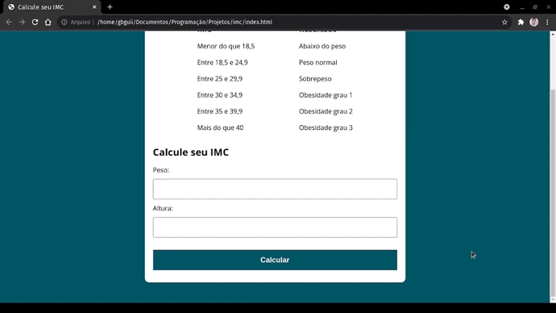

# IMC em JavaScript
#### Calculo de imc é usado para verificar em que nível de condicionamento físico uma pessoa esta.
### Funcionalidaes:
#### 1. Calcular IMC com os dados de altura e peso do usuário.
#### 2. Verificação se os campos estão recebendo valores válidos para fazer o calculo, sendo mostrado uma mensagem quando não forem válidos.
#### 3. Informar para o usuário qual seu IMC e seu nível de condicionamento físico.

